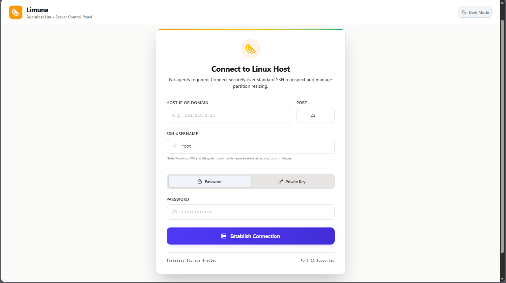
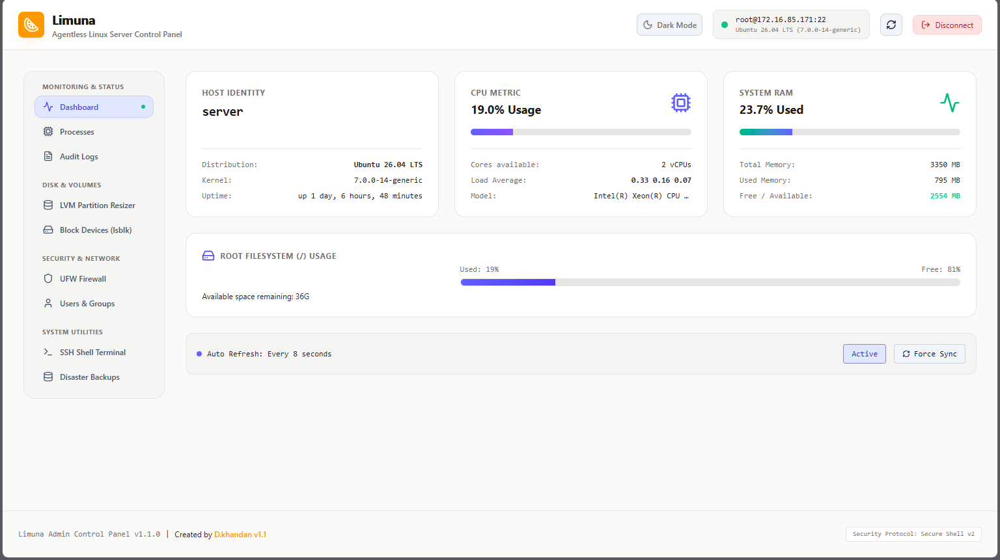
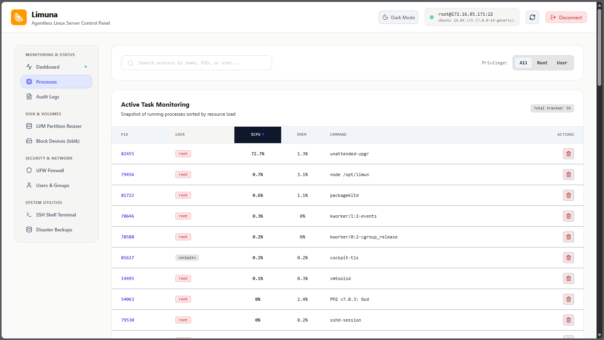
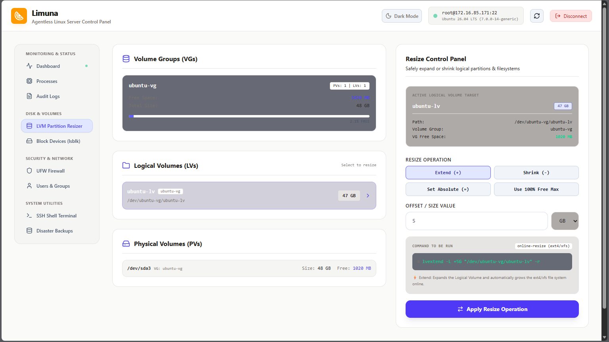
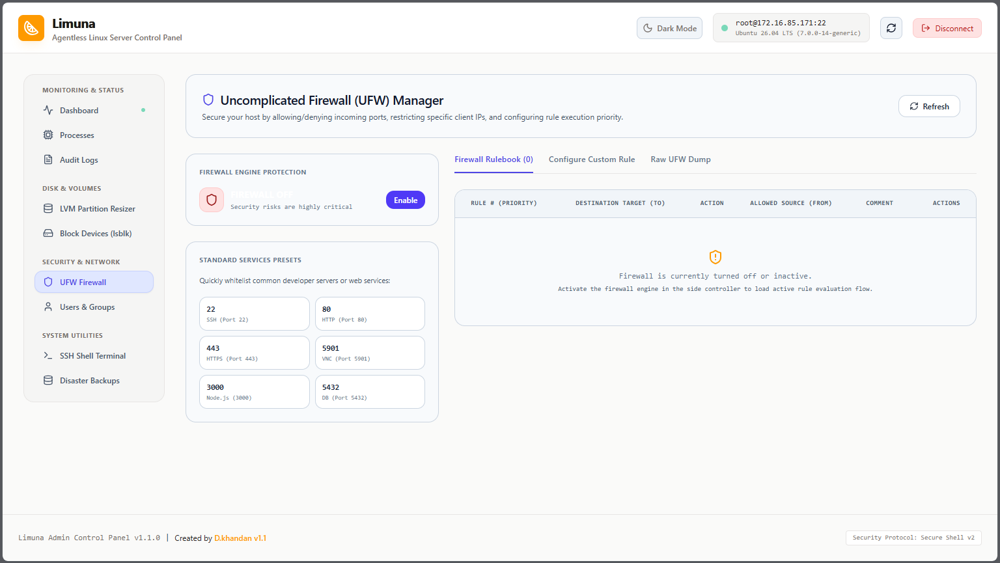
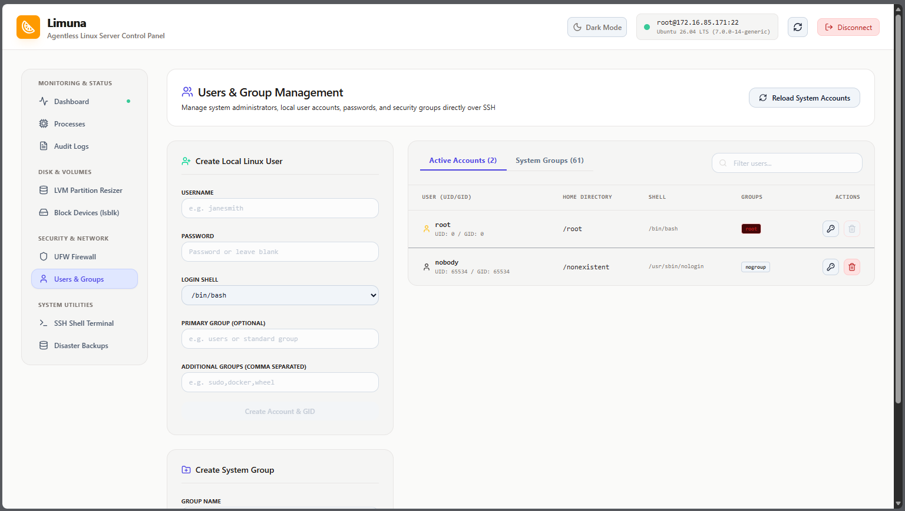
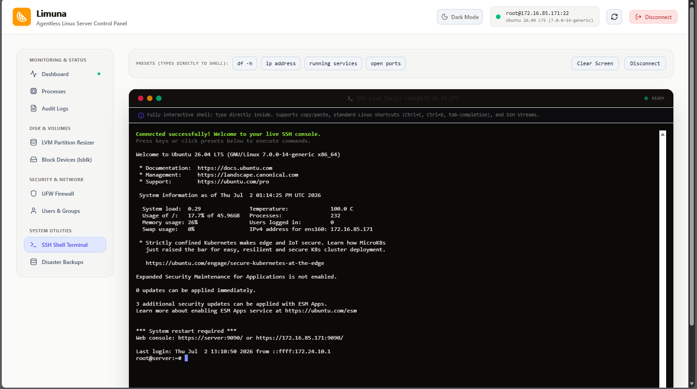

# 🍋 Limuna

> A lightweight Linux server management panel over SSH — **No Agent Required**

[🇮🇷 فارسی](README.fa.md)

---

## Overview

Limuna is a modern Linux server management panel that runs entirely in **user-space** and communicates with remote Linux servers securely over **SSH**.

Unlike traditional server management tools, **Limuna does not require installing any agent** on the destination server.

It maintains a persistent SSH connection cache and temporarily caches safe read-only operations to minimize SSH process creation and reduce server resource usage.

---




## Features

### 🔐 Agentless Architecture

- No daemon installation
- No client installation
- Uses standard SSH authentication
- Works with almost every Linux distribution

---

### ⚡ Optimized SSH Engine

- Persistent SSH connection pool
- Reuses existing SSH sessions
- Smart 3-second cache for read-only queries
- Significantly reduces SSH overhead

---

### 👥 User Management

- Create users
- Delete users
- Reset passwords
- Manage Linux groups
- Add/Remove users from groups

---

### 💾 Disk & Storage Management

- View disks
- View partitions
- Mount / Unmount
- Disk usage visualization
- LVM management
- Extend Logical Volumes
- Resize ext4 filesystems

---

### 🖥️ System Monitoring

- Graphical htop-like dashboard
- CPU Usage
- RAM Usage
- Load Average
- Processes
- Disk I/O
---

### 🔥 UFW Firewall Management

- Enable / Disable UFW
- List Rules
- Add Rules
- Insert Rules
- Delete Rules
- Reorder Rules

---

### 📦 Backup Engine

- Directory backup
- Disk backup
- Live archive generation
- Backup plans
- Recovery command generation

---

### 📜 Live Log Viewer

Watch logs in real time:

- auth.log
- syslog
- journalctl
- systemd units
- custom log files

---

### 💻 Web SSH Terminal

Built-in browser SSH terminal.

No additional software required.

---

### 🎨 Modern Interface

- Lime theme
- Responsive UI
- Custom SVG icons
- High contrast
- Fast navigation

---

# Requirements

- Ubuntu / Debian (recommended)
- Node.js
- npm
- Git
- PM2

---

# Installation

Clone inside `/opt`.

```bash
cd /opt

git clone https://github.com/dwnilii/Limuna.git limuna

cd limuna

npm install

npm run build

npm install -g pm2

pm2 start ecosystem.config.cjs
```

---

## Repository

https://github.com/dwnilii/Limuna

---

## License

MIT License

---

Made with ❤️ for Linux administrators.
